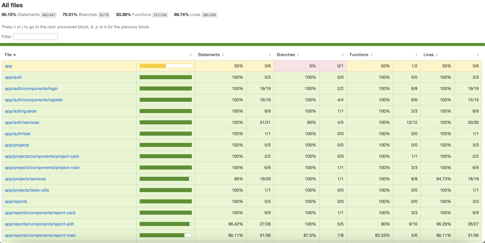

<p align="center">
  <a href="https://angular.io/docs" target="__blank"></a>
</p>

# Projectify

#### \* This project was generated with [Angular CLI](https://github.com/angular/angular-cli) version 14.2.9.

# Technologies used

<p align="left">
  <a href="https://angular.io/docs" target="__blank"></a>
</p>


# Code structure

```
app/
  ├── module/
    ├── components/
    ├── guards/
    ├── models/
    ├── services/
    ├── tests (mock and utils for testing)/

```

# Results

## Deployed website

<a href= 'https://taupe-cat-ed2fb6.netlify.app' target="__blank">https://taupe-cat-ed2fb6.netlify.app</a>

## Tests

- Testing Results:

<p align="left">
  <a target="__blank"></a>
</p>

## App overview video

<a href= 'https://drive.google.com/file/d/1vz8FQvslvEH11MCxxSQb9yeT1nLGcolC/view?usp=sharing' target="__blank">https://drive.google.com/file/d/1vz8FQvslvEH11MCxxSQb9yeT1nLGcolC/view?usp=sharing</a>

# Clone Project and run it locally

1. Make sure you got docker-desktop installed on your pc
2. Clone the Repository

```
https://github.com/dasanchez11/the-mdb.git
```

3. Create a **.env** that has the same parameters as the **.env.example** and add environment variables

```
BASE_URL = 'http://localhost:3002'
```

4. Run the app on Docker

```
docker-compose up -d
```

5. Open the app on your web browser

```
http://localhost:4200/
```

6. Enjoy
